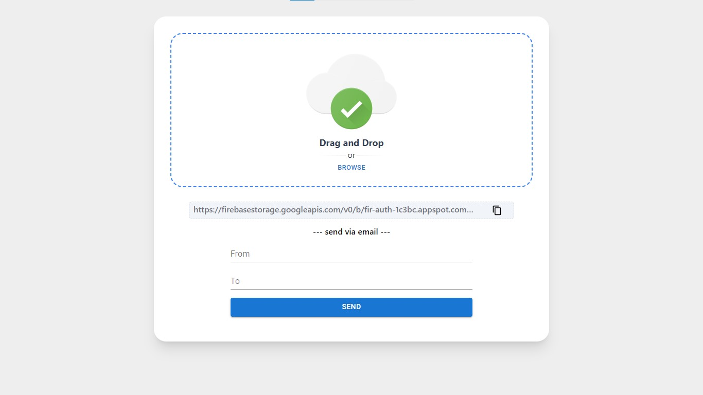

# File Sharing App

This repo is capbale of pretty much what the title says. simply choose a file, upload it, copy the   file link and sharing with anyone with internet. Additionally, you can share files via emai, this wasn't necessary though just wanna check if I could do it.



## see it in action 🚀
[🔴 Live Demo](https://snapsharefile.vercel.app)


## Packages 📚
1. **Material Ui**: Used for sleek and responsive UI components.
2. **Axios:** Facilitates seamless HTTP requests.
3. **Firebase:** Powers file storage and retrieval.
4. **Framer Motion:** Enhances UI with smooth animations.
5. **React Hot Toast:** Provides elegant toast notifications.
6. **Cors:** Enables Cross-Origin Resource Sharing.
7. **Express.js:** A robust Node.js framework for the server.
8. **Multer:** Handles file uploading on the server.
9. **Node Mailer:** Integrates email functionality for sharing links.

## Features ✨
1. **Drag 'n' Drop:** Intuitive file uploading through drag-and-drop.
2. **Resume & Pause:** Ability to pause and resume file uploads.
3. **Upload Progress:** Real-time tracking of file upload progress.
4. **Send Link via Email:** Share files conveniently via email.

## Run on you machine 💻
Follow these steps to run the app locally:

```bash
git clone https://github.com/vishal-gg/File-Sharing-App--prod.git 
cd File-Sharing-App--prod/client
npm install
npm run dev
cd ..
cd server
npm install
npm run dev
```
